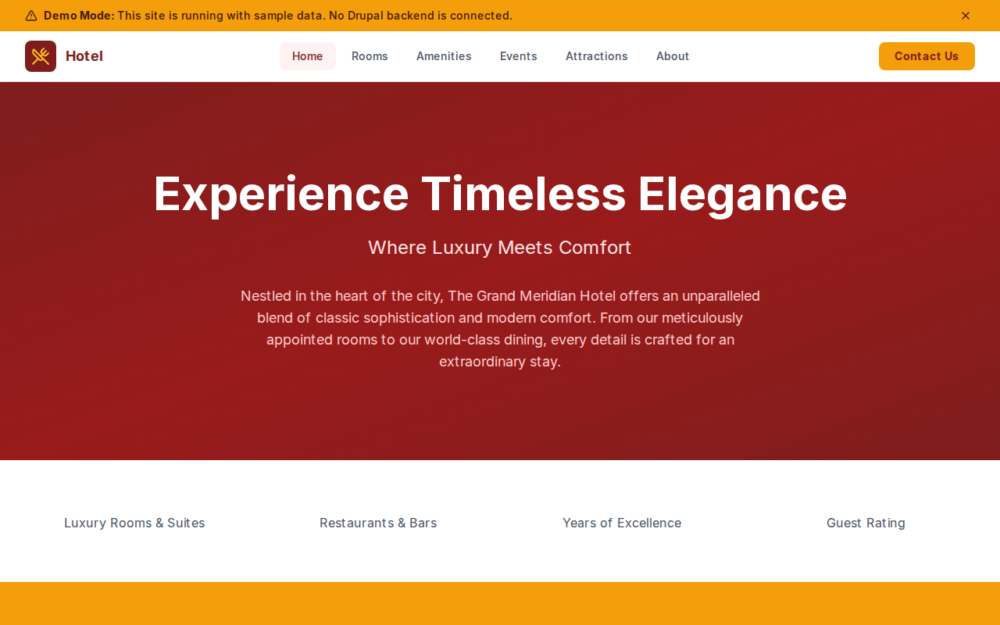

# Decoupled Hotel

A luxury hotel website starter template for Decoupled Drupal + Next.js. Built for boutique hotels, resorts, inns, and hospitality properties.



## Features

- **Rooms & Suites** - Showcase accommodations with pricing, capacity, square footage, and room type categories
- **Amenities** - Hotel amenities and services including spa, dining, pool, and fitness with hours and locations
- **Events** - Hotel events and seasonal activities such as wine dinners, live music, and garden parties
- **Attractions** - Nearby points of interest with distance from hotel and website links
- **Modern Design** - Clean, accessible UI optimized for hospitality content

## Quick Start

### 1. Clone the template

```bash
npx degit nextagencyio/decoupled-hotel my-hotel
cd my-hotel
npm install
```

### 2. Run interactive setup

```bash
npm run setup
```

This interactive script will:
- Authenticate with Decoupled.io (opens browser)
- Create a new Drupal space
- Wait for provisioning (~90 seconds)
- Configure your `.env.local` file
- Import sample content

### 3. Start development

```bash
npm run dev
```

Visit [http://localhost:3000](http://localhost:3000)

---

## Manual Setup

If you prefer to run each step manually:

<details>
<summary>Click to expand manual setup steps</summary>

### Authenticate with Decoupled.io

```bash
npx decoupled-cli@latest auth login
```

### Create a Drupal space

```bash
npx decoupled-cli@latest spaces create "My Hotel"
```

Note the space ID returned. Wait ~90 seconds for provisioning.

### Configure environment

```bash
npx decoupled-cli@latest spaces env 1234 --write .env.local
```

### Import content

```bash
npm run setup-content
```

This imports:
- Homepage with hero, stats (200+ rooms, 5 restaurants, 95+ years, 4.9 guest rating), and booking CTA
- 4 rooms: Presidential Suite, Deluxe King Room, Garden Suite, Classic Double Room
- 4 amenities: Spa & Wellness Center, Rooftop Infinity Pool, The Meridian Restaurant, Fitness Center
- 3 events: Wine Pairing Dinner with Chef Isabella, Jazz on the Rooftop, Annual Spring Garden Party
- 3 attractions: National Art Museum, City Botanical Gardens, The Grand Theater
- 2 static pages: About The Grand Meridian Hotel, Hotel Policies

</details>

## Content Types

### Room
- **room_type**: Room category taxonomy (Suite, Deluxe, Standard)
- **price_per_night**: Nightly rate display (e.g., "From $899")
- **capacity**: Maximum number of guests
- **sqft**: Room size in square feet
- **image**: Room photo

### Amenity
- **amenity_category**: Category taxonomy (Wellness, Dining, Recreation)
- **hours**: Operating hours
- **location**: Where to find the amenity on property
- **image**: Amenity photo

### Event
- **event_date**: Event start date and time
- **end_date**: Event end date and time
- **location**: Event venue within the hotel
- **event_type**: Event category taxonomy (Dining, Entertainment, Seasonal)
- **image**: Event image

### Attraction
- **distance**: Distance from hotel (e.g., "0.3 miles")
- **website_url**: External link to the attraction
- **image**: Attraction photo

### Homepage
- **hero_title**: Main headline (e.g., "Experience Timeless Elegance")
- **hero_subtitle**: Tagline (e.g., "Where Luxury Meets Comfort")
- **hero_description**: Introductory paragraph
- **stats_items**: Key statistics (rooms, restaurants, years, rating)
- **featured_rooms_title**: Section heading for featured rooms
- **cta_title / cta_description**: Booking call-to-action

### Basic Page
- General-purpose static content pages (About, Policies, etc.)

## Customization

### Colors & Branding
Edit `tailwind.config.js` to customize colors, fonts, and spacing.

### Content Structure
Modify `data/hotel-content.json` to add or change content types and sample content.

### Components
React components are in `app/components/`. Update them to match your design needs.

## Demo Mode

Demo mode allows you to showcase the application without connecting to a Drupal backend.

### Enable Demo Mode

```bash
NEXT_PUBLIC_DEMO_MODE=true
```

### Removing Demo Mode

1. Delete `lib/demo-mode.ts`
2. Delete `data/mock/` directory
3. Delete `app/components/DemoModeBanner.tsx`
4. Remove `DemoModeBanner` from `app/layout.tsx`
5. Remove demo mode checks from `app/api/graphql/route.ts`

## Deployment

### Vercel (Recommended)
[](https://vercel.com/new/clone?repository-url=https://github.com/nextagencyio/decoupled-hotel)

### Other Platforms
Works with any Node.js hosting platform that supports Next.js.

## Documentation

- [Decoupled.io Docs](https://www.decoupled.io/docs)
- [Next.js Documentation](https://nextjs.org/docs)
- [Drupal GraphQL](https://www.decoupled.io/docs/graphql)

## License

MIT
